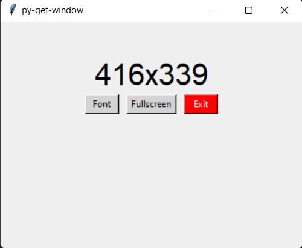

# window size
***

## Скрипт, который измеряет размер активного окна в реальном времени.
***
## Возможности
* **Отслеживает размер окна в реальном времени**
* **Можно менять размер шрифта**

* **Добавлена кнопка полноэкранного режима**
